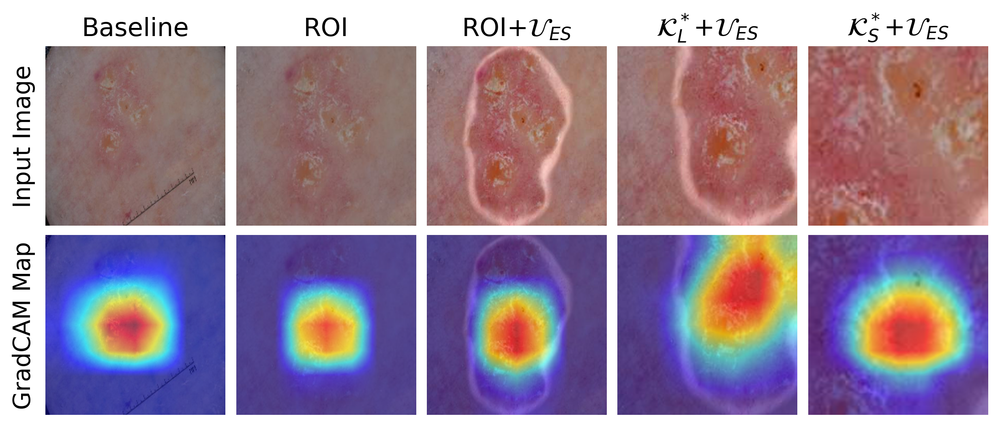
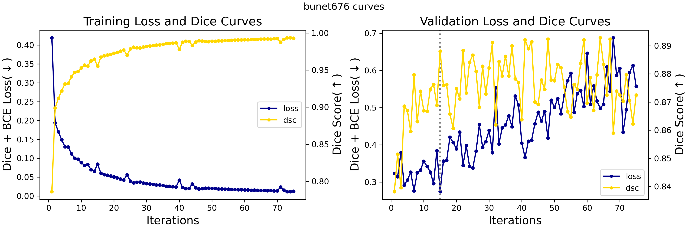

# Work Smarter Not Harder: A Novel Uncertainty-Driven Segmentation Framework for Enhanced Skin Lesion Classification
<a href="https://pytorch.org/"></a>
<a href="https://www.python.org"></a>

<a href="https://docs.conda.io/projects/conda/en/latest/index.html"></a>

_Uncertainty-Driven Segmentation for Skin Lesion Classification_  

---


---

## 📊 Current Results
|        Network        | Accuracy_SK |   Accuracy_M   |   AUROC   |
|-----------------------|:-----------:|:--------------:|:---------:|
|Baseline Xception      |   88.17%    |     83.33%     |   88.17%  |
|Xception+ROI (ours)    |   91.17%    |     80.67%     |   89.66%  |
|Expert Ensemble (ours) | **93.33%**  |   **84.83%**   | **92.08%**|

for Seborrheic Keratosis (SK) and melanoma (M) classification.


*Example GradCAM saliency maps from each member of the expert ensemble on corresponding input images.*

---

## 🔏 Current License and Restrictions

This repository is under a **restrictive license** to protect the intellectual property of the authors during ongoing research.  
### Restrictions:
- This code is provided **for reference purposes only**.
- You may not use, modify, copy, or distribute the code without explicit, written permission from the authors.
- Breach of these terms is a violation of the license agreement.  

### Future Licensing:
- The project will be relicensed under the **Apache 2.0 License** after the associated research is published.

---

## 🛠️ Usage
### Installation

You can easily set up all appropriate dependencies for this project with **a single command** using [conda virtual environments](https://docs.conda.io/projects/conda/en/latest/user-guide/getting-started.html).


<details>
<summary><b>0. Environment naming </b>(optional)</summary>
  Change the 'name' key at the top of the 'environment.yml' file to customize your virtual environment name.
</details>

<details>
<summary><b>1. Install dependencies </b></summary>

    conda env create -f environment.yml
    conda activate my_env
</details>

### Data

The skin lesion data is open-source and available through the [ISIC Archive](https://challenge.isic-archive.com/data/#2017). Images (`images`) and corresponding ground truth masks (`masks_gt`) for each phase should be structured as follows to be compliant with the codebase:
``` bash
.
├── ...
├── plots
├── results
├── testing
│   ├── images
│   ├── masks_gt
├── training
│   ├── images
│   └── masks_gt
├── validation
│   ├── aug_vs2
│   ├── vs1
│   └── vs2
├── weights
├── ...
```

### Training
To train a single classifier run:
```console
> python train_classification.py -h
usage: train_classification.py [-h] [--image_size IMAGE_SIZE] [--channels CHANNELS] [--batch_size BATCH_SIZE]
                               [--epochs EPOCHS] [--lr LR] [--beta1 BETA1] [--beta2 BETA2] [--eps EPS]
                               [--patience PATIENCE] [--num_workers NUM_WORKERS] [--pin_memory PIN_MEMORY]
                               [--device DEVICE] [--device_num DEVICE_NUM] [--seed SEED]
                               model_type

Parameters for classification training.

positional arguments:
  model_type                Model type.

optional arguments:
  -h, --help                show this help message and exit
  --image_size IMAGE_SIZE   The size of the input image.
  --channels CHANNELS       The number of channels of the input image.
  --batch_size BATCH_SIZE   Batch size.
  --epochs EPOCHS           Number of epochs.
  --lr LR                   Learning rate.
  --beta1 BETA1             Beta 1.
  --beta2 BETA2             Beta 2.
  --eps EPS                 Epsilon.
  --patience PATIENCE       Epochs prior to initiating SWA replacement.
  --num_workers NUM_WORKERS Number of workers for the data loader.
  --pin_memory PIN_MEMORY   Pin memory for the data loader.
  --device DEVICE           Device to use for training.
  --device_num DEVICE_NUM   Device number.
  --seed SEED               Random seed
```
and your classifier will be automatically saved to `./weights/ind_{MODEL_TYPE}_model.pth`.

### Prediction

After training and saving your model, you can easily test predictions on your images via the CLI.

To evaluate your classifier and save its results in a .json file:

`python3 test.py {MODEL_TYPE} {MODEL_SAVE_PATH}`

with the correct model type specified and the path to your trained model.

``` console
> python test.py -h
usage: test.py [-h] [--image_size IMAGE_SIZE] [--channels CHANNELS] [--batch_size BATCH_SIZE] [--save_results SAVE_RESULTS]
               [--num_workers NUM_WORKERS] [--pin_memory PIN_MEMORY] [--device DEVICE] [--device_num DEVICE_NUM] [--seed SEED]
               model_type model_save_path

Parameters for inference.

positional arguments:
  model_type                  Model type.
  model_save_path             Path to trained model weights.

optional arguments:
  -h, --help                  show this help message and exit
  --image_size IMAGE_SIZE     The size of the input image.
  --channels CHANNELS         The number of channels of the input image.
  --batch_size BATCH_SIZE     Batch size.
  --save_results SAVE_RESULTS Bool saving evaluation results.
  --num_workers NUM_WORKERS   Number of workers for the data loader.
  --pin_memory PIN_MEMORY     Pin memory for the data loader.
  --device DEVICE             Device to use for training.
  --device_num DEVICE_NUM     Device number.
  --seed SEED                 Random seed.
```

### Selection Agent

You can easily visualize the results of the Selection Agent as well. Simply run:

`python3 selection_agent.py`

which automatically saves a plot of segmentation results in `./plots/ex_segmentation.png` and a plot of tailored inputs to each member of the expert ensemble in `./plots/ex_uq-enhanced-data.png` for the image found in `examples/`.

``` console
> python3 selection_agent.py -h
usage: selection_agent.py [-h] [--device DEVICE] [--img_pathname IMG_PATHNAME] [--mask_pathname MASK_PATHNAME]
                          [--label_pathname LABEL_PATHNAME]

Parameters for Selection Agent.

optional arguments:
  -h, --help                        show this help message and exit
  --device DEVICE                   Device to use for training.
  --img_pathname IMG_PATHNAME       Pathname to test image.
  --mask_pathname MASK_PATHNAME     Pathname to mask for test image.
  --label_pathname LABEL_PATHNAME   Path to gold standard diagnosis for test image.
```

### Segmentation

Training new segmentation model(s) for the Segmentation Agent is easy. Simply choose the desired ensemble architecture between [U-Net](https://arxiv.org/pdf/1505.04597) or [Monte Carlo U-Net (MCU-Net)](https://arxiv.org/pdf/2007.03995) and run:

``` console
> python3 train_segmentation.py -h
usage: train_segmentation.py [-h] [--image_size IMAGE_SIZE] [--channels CHANNELS] [--batch_size BATCH_SIZE] [--epochs EPOCHS]
                             [--boot_seed BOOT_SEED] [--loss_crit LOSS_CRIT] [--lr LR] [--beta1 BETA1] [--beta2 BETA2]
                             [--eps EPS] [--num_workers NUM_WORKERS] [--pin_memory PIN_MEMORY] [--device DEVICE]
                             [--device_num DEVICE_NUM] [--perform_es PERFORM_ES] [--save_train_results SAVE_TRAIN_RESULTS]
                             [--save_path SAVE_PATH] [--save_freq SAVE_FREQ] [--seed SEED]
                             {unet,mcunet}

Parameters for segmentation training.

positional arguments:
  {unet,mcunet}                             Model type for training.

optional arguments:
  -h, --help                                show this help message and exit
  --image_size IMAGE_SIZE                   The size of the input image.
  --channels CHANNELS                       The number of channels of the input image.
  --batch_size BATCH_SIZE                   Batch size.
  --epochs EPOCHS                           Number of epochs.
  --boot_seed BOOT_SEED                     Random seed for bootstrapping data.
  --loss_crit LOSS_CRIT                     Combined loss criterion.
  --lr LR                                   Learning rate.
  --beta1 BETA1                             Beta 1.
  --beta2 BETA2                             Beta 2.
  --eps EPS                                 Epsilon.
  --num_workers NUM_WORKERS                 Number of workers for the data loader.
  --pin_memory PIN_MEMORY                   Pin memory for the data loader.
  --device DEVICE                           Device to use for training.
  --device_num DEVICE_NUM                   Device number.
  --perform_es PERFORM_ES                   Early stopping during training.
  --save_train_results SAVE_TRAIN_RESULTS   Whether to save training results.
  --save_path SAVE_PATH                     Directory to save the model.
  --save_freq SAVE_FREQ                     Frequency of epochs to save the model.
  --seed SEED                               Random seed.
```

You can customize hyperparameters such as optimizer, number of epochs, or batch size by setting the appropriate arguments in the command line.


*Example training and validation curves for bootstrapped U-Net segmentation model.*

---

## 📩 Authors and Contact

- **Rohini Banerjee**  [@rohini-banerjee](https://github.com/rohini-banerjee)
For inquiries, permission requests, or collaboration opportunities, please contact rohinib@andrew.cmu.edu.

---

## Intended Use

This repository is shared to provide transparency and demonstrate the methods used in this research. **Unauthorized use, modification, or distribution is strictly prohibited until further specified.**

---