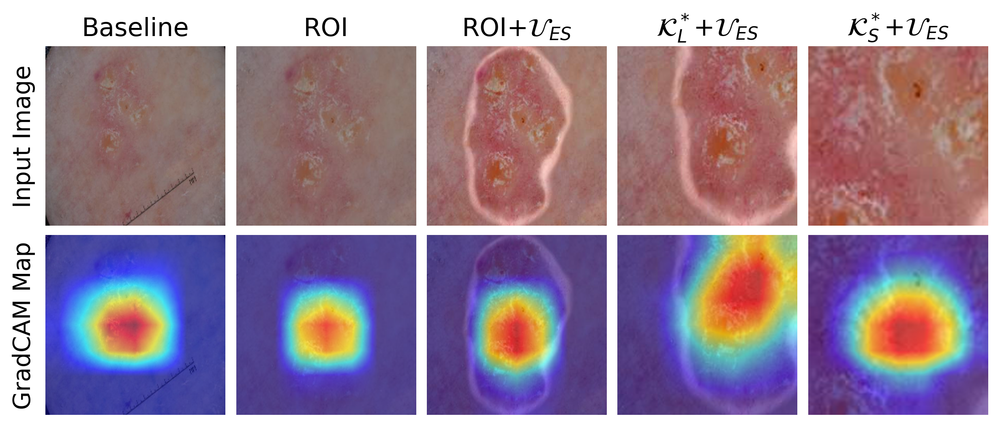

# Work Smarter Not Harder: A Novel Uncertainty-Driven Segmentation Framework for Enhanced Skin Lesion Classification

_Uncertainty-Driven Segmentation for Skin Lesion Classification_  

---

---

## 📊 Current Results
|        Network        | Accuracy_SK |   Accuracy_M   |   AUROC   |
|-----------------------|:-----------:|:--------------:|:---------:|
|Baseline Xception      |   88.17%    |     83.33%     |   88.17%  |
|Xception+ROI (ours)    |   91.17%    |     80.67%     |   89.66%  |
|Expert Ensemble (ours) | **93.33%**  |   **84.83%**   | **92.08%**|

for Seborrheic Keratosis (SK) and melanoma (M) classification.

*Example GradCAM saliency maps from each member of expert ensemble on corresponding input images.*

## 🛠️ Usage
*NOTE:* This repository is currently under development and will be refactored
for deployment soon.

## 🔏 Current License and Restrictions

This repository is under a **restrictive license** to protect the intellectual property of the authors during ongoing research.  
### Restrictions:
- This code is provided **for reference purposes only**.
- You may not use, modify, copy, or distribute the code without explicit, written permission from the authors.
- Breach of these terms is a violation of the license agreement.  

### Future Licensing:
- The project will be relicensed under the **Apache 2.0 License** after the associated research is published.

---

## 📩 Authors and Contact

- **Rohini Banerjee**  [@rohini-banerjee](https://github.com/rohini-banerjee)
For inquiries, permission requests, or collaboration opportunities, please contact rohinib@andrew.cmu.edu.

---

## Intended Use

This repository is shared to provide transparency and demonstrate the methods used in this research. **Unauthorized use, modification, or distribution is strictly prohibited until further specified.**

---